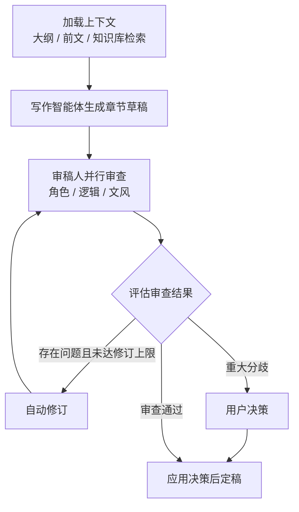

# AI 小说工坊（novel-agent-system）

基于 **LangGraph 多智能体协作** 与 **RAG 知识库** 的长篇小说 AI 创作系统。

系统模拟真实的出版社创作流程：由大纲编辑、主笔、多位审稿人等角色协作，通过「写作 → 审查 → 修订」闭环逐章生成高质量长篇小说，并借助向量知识库保证长篇创作中世界观、人物、伏笔的一致性。

## 功能特性

### 多智能体协作创作

- **大纲智能体**：从创意设定生成全文大纲，支持分卷、分章大纲逐级细化，流式输出
- **写作智能体**：结合章节大纲、前文语义与知识库检索结果撰写章节正文
- **角色智能体**：策展与当前章节相关的角色设定，构建角色心理状态与成长弧线
- **重写智能体**：根据审查意见或用户指令对章节进行 AI 重写

### 多读者审稿机制

每章完成后，多位审稿人**并行**审查：

| 审稿人 | 审查维度 |
|--------|----------|
| 角色审稿人 | 人物性格、动机、成长弧线的一致性 |
| 逻辑审稿人 | 剧情因果、时间线、伏笔衔接 |
| 文风审稿人 | 叙述风格、文笔质量、节奏 |

审查未通过时自动进入修订循环（默认最多 3 轮），存在重大分歧时交由**用户决策**，兼顾自动化与作者掌控权。

### RAG 知识库

- 基于 ChromaDB 向量检索，长篇创作不遗忘前文设定
- **小说知识库**：导入已有小说文本，自动分卷分章，抽取世界观 / 人物 / 剧情知识
- **普通知识库**：可跨小说复用的通用资料库
- 知识图谱可视化（D3.js 力导向图）

### 其他能力

- **多 LLM 供应商管理**：在界面内配置多个 API 供应商，按用途（写作 / 审查 / 嵌入）切换模型，兼容 OpenAI 接口协议
- **联网调研**：集成 Tavily 搜索，辅助世界观构建与资料收集
- **角色立绘生成**：为小说角色生成配图
- **SSE 流式输出**：大纲与章节生成过程实时可见

## 技术栈

| 层级 | 技术 |
|------|------|
| 后端框架 | Python 3.12 · FastAPI · Uvicorn |
| 多智能体 | LangGraph · LangChain |
| 数据库 | SQLite · SQLAlchemy 2.0 (async) · Alembic |
| 向量检索 | ChromaDB |
| 大模型 | SiliconFlow API（OpenAI 兼容协议，支持 DeepSeek 等） |
| 联网搜索 | Tavily |
| 前端 | 原生 HTML / CSS / JavaScript · D3.js |

## 项目结构

```
xiaoshuo/
├── app/
│   ├── agents/              # 多智能体（LangGraph 编排）
│   │   ├── readers/         # 审稿人：角色 / 逻辑 / 文风 / 剧情 / 润色
│   │   ├── graph.py         # 写作-审查-修订工作流编排
│   │   ├── outline_agent.py # 大纲生成
│   │   ├── writer_agent.py  # 章节写作与修订
│   │   ├── character_agent.py # 角色设定策展
│   │   └── rewrite_agent.py # AI 重写
│   ├── api/                 # FastAPI 路由（小说/大纲/章节/审查/知识库/供应商）
│   ├── llm/                 # LLM 客户端（OpenAI 兼容协议）
│   ├── models/              # SQLAlchemy 数据模型
│   ├── rag/                 # ChromaDB 客户端 / 嵌入 / 检索器
│   ├── schemas/             # Pydantic 请求 / 响应模型
│   ├── services/            # 业务逻辑（知识抽取、卷章分割、图像、联网调研等）
│   ├── config.py            # 配置管理（pydantic-settings）
│   ├── database.py          # 数据库连接与初始化
│   └── main.py              # 应用入口
├── static/                  # 前端（写作台 / 大纲 / 知识库 / 设置）
├── .env.example             # 环境变量模板
└── requirements.txt
```

## 快速开始

### 环境要求

- Python 3.12+
- 一个大模型 API Key（默认使用 [SiliconFlow](https://siliconflow.cn)，也支持其他 OpenAI 兼容服务）
- （可选）[Tavily](https://tavily.com) API Key，用于联网调研功能

### 安装步骤

1. 克隆仓库并创建虚拟环境

```bash
git clone https://github.com/ZXT-wudi/novel-agent-system.git
cd novel-agent-system

# 创建并激活虚拟环境
python -m venv venv
# Windows
venv\Scripts\activate
# Linux / macOS
source venv/bin/activate
```

2. 安装依赖

```bash
pip install -r requirements.txt
```

3. 配置环境变量

```bash
cp .env.example .env
```

编辑 `.env`，填入你的 API Key：

```ini
SILICONFLOW_API_KEY=sk-xxxxxxxxxxxxxxxxxxxxxxxx
TAVILY_API_KEY=tvly-xxxxxxxxxxxxxxxxxxxxxxxx
```

4. 启动服务

```bash
uvicorn app.main:app --host 0.0.0.0 --port 8000 --reload
```

5. 打开浏览器访问 <http://localhost:8000> 即可使用；API 文档见 <http://localhost:8000/docs>

### 环境变量说明

| 变量 | 说明 | 默认值 |
|------|------|--------|
| `SILICONFLOW_API_KEY` | 大模型 API 密钥（必填） | - |
| `SILICONFLOW_BASE_URL` | LLM API 地址 | `https://api.siliconflow.cn/v1` |
| `SILICONFLOW_MODEL` | 对话模型 | `deepseek-ai/DeepSeek-V4-Flash` |
| `SILICONFLOW_EMBEDDING_MODEL` | 嵌入模型 | `BAAI/bge-large-zh-v1.5` |
| `TAVILY_API_KEY` | Tavily 联网搜索密钥（可选） | - |
| `DATABASE_URL` | 数据库连接串 | `sqlite+aiosqlite:///./novel_writer.db` |
| `CHROMA_PERSIST_DIR` | 向量库持久化目录 | `./chroma_data` |

> 提示：也可以启动后在「设置」页面中配置多个 LLM 供应商并按用途切换模型，无需重启服务。

## 使用指南

### 创作流程

系统采用向导式创作流程，五步开始写作：

```
创建小说 → 生成全文大纲 → 生成章节大纲 → 确认大纲 → 开始逐章写作
```

### 章节写作工作流

点击「开始写下一章」后，系统按以下流程运行：



- 每章默认最多自动修订 3 轮（可在配置中调整 `MAX_REVISION_ROUNDS`）
- 生成过程通过 SSE 实时展示，可随时查看进度
- 定稿前可手动编辑章节内容，或使用「AI 重写」按指令重写

### 知识库使用建议

- 将同世界观的前作或设定资料导入**小说知识库**，系统会在写作时自动检索相关设定，保持人物与世界观一致
- 通用资料（写作风格指南、题材知识等）放入**普通知识库**，可跨小说复用
- 支持上传长篇小说文本，系统自动分卷分章并抽取知识条目

## API 概览

主要接口分组（完整文档见 `/docs`）：

| 分组 | 前缀 | 说明 |
|------|------|------|
| 小说管理 | `/api/novels` | 小说增删改查、章节、大纲、审查 |
| 知识库 | `/api/knowledge-bases` | 小说知识库与知识条目管理 |
| 普通知识库 | `/api/ordinary-knowledge-bases` | 通用知识库管理 |
| 大模型供应商 | `/api/llm-providers` | 多供应商配置与切换 |

## 注意事项

- `.env` 文件包含 API 密钥，**切勿提交到版本库**（已通过 `.gitignore` 排除）
- 首次启动会自动创建 SQLite 数据库与向量库目录，无需手动初始化
- 长文本导入与知识抽取为异步任务，大文件导入请在页面中等待完成

## License

仅用于个人学习与研究。
